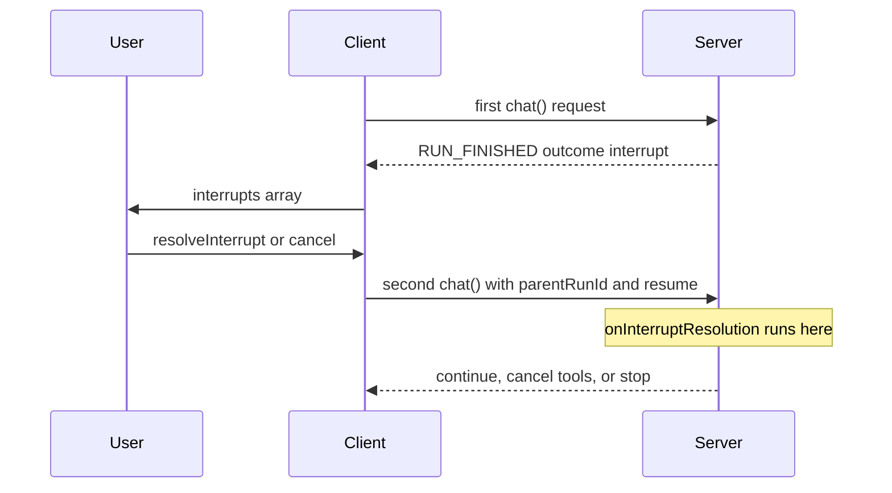

# Apply Answers

The user approved a plan or typed a note. You need that value on the server
before the next model call. `onInterruptResolution` is where you read it. It
does not change config. `onConfig` is where you apply it.

By the end of this page you know when the resolution hook runs, what it can
return, and how to turn the answer into a prompt, a tool list, or a stop.

Define and emit the interrupt first. See [Generic Interrupts](./generic).

## Two `chat()` calls

The pause spans two runs. One user-visible turn. Two `chat()` calls.

**Call 1 (pause).** `onInterruptBoundary` returns `{ interrupts }`. The run
ends with `RUN_FINISHED` and `outcome: interrupt`. The resolution hook does
not run.

**Call 2 (resume).** The client starts a new request after
`resolveInterrupt()` or `cancel()`. The body includes:

- a new `runId`
- `parentRunId` set to the paused run
- `resume` with the answers. Each generic item also has `metadata` with the
  original request (`tanstack:interruptContinuation`)

`useChat` sends those fields for you. If you POST by hand, include all three.
If `resume` is present and `parentRunId` is missing, the server throws.

A hand-built generic resume item looks like this:

```ts
import { wrapGenericInterruptContinuation } from '@tanstack/ai'

const resumeItem = {
  interruptId: 'generic-1',
  status: 'resolved' as const,
  payload: { approved: true },
  metadata: wrapGenericInterruptContinuation({
    v: 1,
    definitionId: 'review-plan',
    key: 'turn-1',
    batchIndex: 0,
    reason: 'review',
    message: 'Review the plan',
  }),
}
```



## Exact place in the second call

```
setup
onConfig                 (phase is init)
onInterruptResolution    (phase is still init)
onStart
then stop, or continue the agent loop
```

The hook runs **once**, at the start of the continuation. It does not run at
`beforeModel`, `afterModel`, `beforeTools`, or `afterTools`.

`ctx.phase` is `'init'`. `ctx.iteration` is `0`. No model call has started.

The hook runs once per batch. Two cards in one pause still produce one hook
call with both answers.

The hook does not run on the first user message. It does not run for a
tool-approval or client-tool batch that has no generic interrupt.

If that continuation pauses again, that is a third `chat()` call. The hook
runs again at the start of that third call.

## Read the typed answers

```ts
import type { ChatMiddleware } from '@tanstack/ai'
import { reviewPlan } from './interrupts'

export const applyReview: ChatMiddleware<unknown, typeof reviewPlan> = {
  name: 'apply-review',
  onInterruptResolution(_ctx, resumedInterrupts) {
    for (const result of resumedInterrupts.for(reviewPlan)) {
      if (result.status === 'resolved' && !result.response.approved) {
        return { toolResume: 'stop' }
      }
    }
  },
}
```

- `resumedInterrupts.for(reviewPlan)` keeps the response type for that
  definition
- `resumedInterrupts.all()` returns every registered answer
- `resumedInterrupts.all(reviewPlan, otherDefinition)` narrows to those
  definitions

Each item is `resolved` (with `response`) or `cancelled`.

## What the hook can return

Return `toolResume` to decide what happens to **pending tools** from the
paused turn:

| Value | Effect |
| --- | --- |
| `continue` | Run the pending tools |
| `cancel` | Mark the pending tools as cancelled. Do not run them |
| `stop` | End the run after `onStart`. No tools. No model call |

When more than one middleware returns a value, the engine keeps the stricter
one. `stop` wins over `cancel`. `cancel` wins over `continue`.

If a generic interrupt shares a batch with client tools, the client does not
run those client tools until `toolResume` is `continue`. `cancel` and `stop`
skip them. After `continue`, the engine emits the client-tool wait again.

After a `continue`, the engine picks up from the phase that paused:

| First run paused at | Next step |
| --- | --- |
| `beforeModel` | The model call |
| `afterModel` | Tools, if the model asked for them |
| `beforeTools` | Tool execution |
| `afterTools` | The next model turn (the tools already ran) |

## What the hook cannot change

`onInterruptResolution` cannot change config. It cannot change the model or
the adapter.

These fields change only from `onConfig` (or `onStructuredOutputConfig`):

- `messages`
- `systemPrompts`
- `tools`
- `modelOptions`
- `metadata`

The user answer is **not** added to `messages` by itself. If the model must
see the note, you add it.

## Apply the answer in `onConfig`

Order on the continuation:

1. `onConfig` with `phase: 'init'`. The answers are not applied yet.
2. `onInterruptResolution`. Read the answers and store them on the run.
3. `onConfig` with `phase: 'beforeModel'`. Return the new prompts, tools, or
   messages.

Store the answer in a [middleware capability](../advanced/middleware#capabilities).
The value lives on `ctx` for this `chat()` call. Another middleware can
declare `requires` and read the same note. Two overlapping `chat()` calls do
not share the value.

If you list the capability in `provides`, you must provide it in `setup`.
You do not have the user answer yet. Provide an empty box first. Write the
answer in `onInterruptResolution`.

```ts
import { createCapability, type ChatMiddleware } from '@tanstack/ai'
import { reviewPlan } from './interrupts'

export const reviewNote = createCapability<{ note?: string }>()('review-note')
export const [getReviewNote, provideReviewNote] = reviewNote

export const reviewMiddleware: ChatMiddleware<unknown, typeof reviewPlan> = {
  name: 'review-plan',
  provides: [reviewNote],
  setup(ctx) {
    provideReviewNote(ctx, {})
  },
  onInterruptBoundary(ctx) {
    if (ctx.phase !== 'beforeModel') return
    if (ctx.parentRunId) return
    return {
      interrupts: [
        reviewPlan.interrupt({
          key: 'initial-plan',
          reason: 'review-required',
          message: 'Review the proposed plan.',
          payload: {
            title: 'Release plan',
            changes: ['Add search'],
          },
        }),
      ],
    }
  },
  onInterruptResolution(ctx, resumed) {
    const [result] = resumed.for(reviewPlan)
    if (result?.status !== 'resolved') return
    provideReviewNote(ctx, { note: result.response.note })
    if (!result.response.approved) {
      return { toolResume: 'stop' }
    }
  },
  onConfig(ctx, config) {
    if (ctx.phase !== 'beforeModel') return
    const note = getReviewNote(ctx).note
    if (!note) return
    return {
      systemPrompts: [
        ...config.systemPrompts,
        `User review note: ${note}`,
      ],
    }
  },
}
```

Register the object on `chat({ middleware: [reviewMiddleware] })`.

A later middleware can read the same note:

```ts
import { type ChatMiddleware } from '@tanstack/ai'
import { getReviewNote, reviewNote } from './review-plan'

export const applyVoice: ChatMiddleware = {
  name: 'apply-voice',
  requires: [reviewNote],
  onConfig(ctx, config) {
    const note = getReviewNote(ctx).note
    if (!note) return
    return {
      systemPrompts: [...config.systemPrompts, `Voice note: ${note}`],
    }
  },
}
```

Other hooks that can change behavior, but not this resume payload:

- `onBeforeToolCall` can rewrite args, skip a tool, or abort
- `onChunk` can rewrite or drop stream events
- `onShouldContinue` can return `false` to stop the loop with a normal finish

See [Middleware](../advanced/middleware) for those hooks.

## Persistence

With [chat persistence](../persistence/chat-persistence), the hook still runs
at the same moment: after init `onConfig`, before `onStart`.

Persistence rebuilds the pending requests from the store and clears
`config.resume` so the engine does not rebuild them from client history. You
still read answers from `resumedInterrupts.for(definition)`.

## Register both sides

The continuation needs the same definitions and the same middleware as the
paused run. Forward `parentRunId` and `resume` from the request.

```ts
// app/api/chat/route.ts
import {
  chat,
  chatParamsFromRequest,
  toServerSentEventsResponse,
} from '@tanstack/ai'
import { openaiText } from '@tanstack/ai-openai'
import { reviewMiddleware } from '../../chat-middleware'
import { reviewPlan } from '../../interrupts'

export async function POST(request: Request) {
  const params = await chatParamsFromRequest(request)
  const stream = chat({
    adapter: openaiText('gpt-5.5'),
    messages: params.messages,
    threadId: params.threadId,
    runId: params.runId,
    ...(params.parentRunId ? { parentRunId: params.parentRunId } : {}),
    ...(params.resume ? { resume: params.resume } : {}),
    interrupts: [reviewPlan],
    middleware: [reviewMiddleware],
  })
  return toServerSentEventsResponse(stream)
}
```
