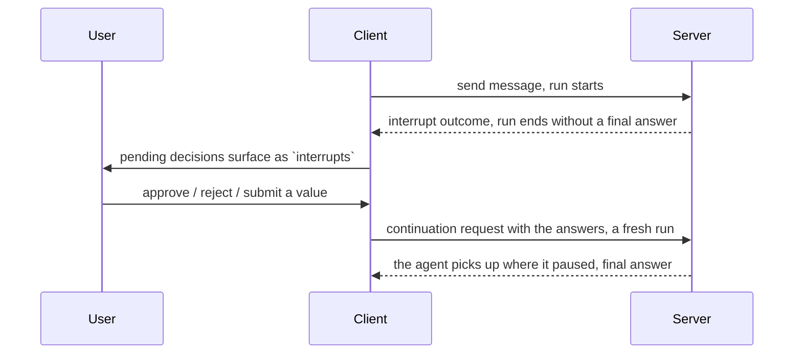

# Interrupts

Most agent runs are fire and forget. The model calls tools, they run, you get an
answer back. But some steps must not happen on their own: moving money,
deleting a project, sending an email. And sometimes the agent needs an answer
only the user can give before it can go on.

An interrupt is a pause. The run stops, hands you a decision to make, and then
picks up exactly where it left off once you answer.

## How it works

1. The server reaches a step that needs a decision and ends the run with an
   `interrupt` outcome instead of a final answer.
2. The client gives you the pending decisions as `interrupts`.
3. You resolve each one (approve, reject, submit a value, or cancel).
4. The client starts a fresh continuation run that carries your answers and
   continues the agent.



Note that the pause spans **two runs**: the interrupted one ends, and the
continuation is a new run. One user-visible turn, two run lifecycles. See
[Threads and runs](../chat/streaming#threads-and-runs).

No database is required. The browser sends the full message history back on the
continuation request, so a stateless server can rebuild the paused step and keep
going.

## What pauses a run

Two kinds of interrupt show up in the `interrupts` array for you to resolve:

| `kind` | You get a pause when | Guide |
| --- | --- | --- |
| `tool-approval` | A tool is marked `needsApproval` and the model calls it | [Tool Approval](./tool-approval) |
| `generic` | Middleware requests typed client data at a lifecycle boundary | [Generic Interrupts](./generic) |

## First-party generic interrupts

For a generic interrupt that TanStack AI owns, define it once with
`defineInterrupt()`. Register the definition with both `chat({ interrupts })`
and `useChat({ interrupts })`. Middleware emits it through
`onInterruptBoundary`, and the client receives a typed bound item that it can
resolve or cancel. See [Generic Interrupts](./generic). To pick a phase, see
[Lifecycle Boundaries](./boundaries). To apply the answer, see
[Apply Answers](./apply-answers).

## External generic interrupts

An interrupt is a standard AG-UI object, and TanStack AI is not the only thing
that can put one on a stream. A workflow engine pausing for a durable approval,
or another agent framework sharing the same connection, emits the same envelope.

There are three cases:

- A registered first-party generic interrupt has `kind: 'generic'`, a literal
  `definitionId`, typed `payload`, and a typed `resolveInterrupt` method.
- An external generic interrupt with a valid binding also has `kind: 'generic'`.
  Its response is `unknown`, but it has `resolveInterrupt`, `cancel`, and
  `clearResolution`. It joins the root batch controls.
- An interrupt with a missing, malformed, or unsupported binding has
  `kind: 'unbound'`. It remains visible, but has no controls.

The binding is stored in the interrupt metadata under
`INTERRUPT_BINDING_METADATA_KEY`. It records the interrupted run and generation.
The client uses it to send the answer to the matching paused step.

Render unbound items as status information. Do not render a response form for
them:

```tsx
import { fetchServerSentEvents, useChat } from '@tanstack/ai-react'
import { toolDefinition } from '@tanstack/ai'
import { z } from 'zod'

const transferTool = toolDefinition({
  name: 'transfer',
  description: 'Move money between accounts',
  needsApproval: true,
  inputSchema: z.object({ recipient: z.string(), amount: z.number() }),
  outputSchema: z.object({ receiptId: z.string() }),
}).client()

export function Pauses() {
  const { interrupts } = useChat({
    threadId: 'thread-1',
    connection: fetchServerSentEvents('/api/chat'),
    tools: [transferTool] as const,
  })

  return (
    <>
      {interrupts.map((interrupt) => {
        if (interrupt.kind === 'unbound') {
          return (
            <p key={interrupt.id}>
              External pause: {interrupt.message ?? interrupt.reason}
            </p>
          )
        }
        if (interrupt.kind === 'generic') {
          return (
            <article key={interrupt.id}>
              <p>{interrupt.message ?? interrupt.reason}</p>
              <button
                onClick={() =>
                  interrupt.resolveInterrupt({ speed: 'express' })
                }
              >
                Choose express
              </button>
              <button onClick={() => interrupt.cancel()}>Cancel</button>
              <button onClick={() => interrupt.clearResolution()}>
                Clear choice
              </button>
            </article>
          )
        }
        return (
          <button
            key={interrupt.id}
            onClick={() => interrupt.resolveInterrupt(true)}
          >
            Approve {interrupt.toolName}
          </button>
        )
      })}
    </>
  )
}
```

The library will not invent a binding to make these resolvable. Doing so would
render a form whose answer is sent to a run that has nothing pending. The
submit would fail only after the user has filled it in. `unbound` says that
the pause belongs to something else. Unbound items never block you from
resolving the ones that are yours.

If an external producer wants the chat client to resume its pause, attach a
valid binding with `withInterruptBinding`. Do not write the metadata key by
hand. Use the exact interrupted run id and generation that own the pause:

```ts
import {
  INTERRUPT_BINDING_VERSION,
  canonicalInterruptJson,
  digestInterruptJson,
  withInterruptBinding,
} from '@tanstack/ai'

const responseSchema = {
  type: 'object',
  properties: { speed: { type: 'string' } },
  required: ['speed'],
}

const descriptor = withInterruptBinding(
  {
    id: 'shipping-1',
    reason: 'confirmation',
    message: 'Which shipping speed?',
    responseSchema,
  },
  {
    v: INTERRUPT_BINDING_VERSION,
    kind: 'generic',
    interruptId: 'shipping-1',
    interruptedRunId: 'run-42',
    generation: 0,
    // The server checks the schema it hands out still matches the one it
    // validates against, so the hash is computed from the schema itself.
    responseSchemaHash: digestInterruptJson(
      canonicalInterruptJson(responseSchema),
    ),
  },
)
```

The client treats this as an untyped generic interrupt. The example above can
stage a value, cancel it, or clear the draft. It can also join
`resolveInterrupts(...)` with tool approvals and first-party generic interrupts.

`v` is the binding wire version. The client rejects unknown versions and bad
fields. Those interrupts become `unbound` rather than a form that cannot
resume the owner.

## What about client tools?

A tool with a `.client()` implementation runs in the browser on its own and
reports its own result. That is not a decision you make, so it never appears in
`interrupts`. See [Client Tools](../tools/client-tools).

If persistence restores a pending client-tool execution, the client leaves it
pending rather than running the browser code again. See
[Client persistence](../persistence/client-persistence#handle-restored-client-tools)
for recovery policies.

The one time a tool pauses is when you mark it `needsApproval: true`. Then it
stops for a yes or no first, whether it runs on the server or in the browser:

| Tool | What you handle |
| --- | --- |
| Server tool | Nothing, unless `needsApproval` adds a `tool-approval` pause. It then runs on the server after you approve. |
| Client tool | Nothing, it runs in the browser automatically. With `needsApproval` it pauses for approval first, then runs in the browser. |

So approval is the only thing you resolve for either kind of tool, and both use
the same `tool-approval` interrupt.

## Where to go next

| You want to | Page |
| --- | --- |
| Approve or reject a single tool call | [Tool Approval](./tool-approval) |
| Resolve several pending decisions at once | [Multiple Interrupts](./multiple) |
| Ask the user something that isn't a tool | [Generic Interrupts](./generic) |
| Pick `beforeModel`, `afterModel`, `beforeTools`, or `afterTools` | [Lifecycle Boundaries](./boundaries) |
| Apply a generic answer to prompts or stop the run | [Apply Answers](./apply-answers) |
| Run a tool in the browser | [Client Tools](../tools/client-tools) |
| Move off the old `approval-requested` events | [Migration](./migration) |
